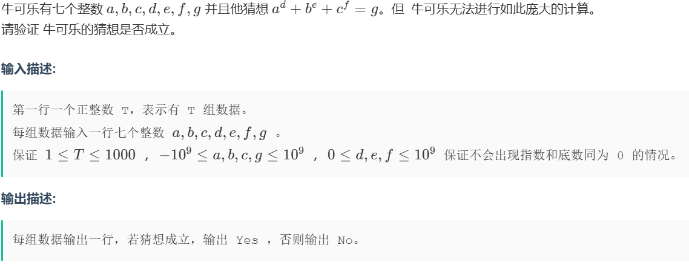

# 题目整理

[TOC]

## 练习题
>这里收录着各种练习题，可能是由更好的思路或是我根本不会

### 洛谷
#### P1067 [NOIP 2009 普及组] 多项式输出

- **题号**: P5678
- **链接**: [题目链接](https://www.luogu.com.cn/problem/P1067)
- **算法类型**: 模拟
- **错误原因**:
  - 分类讨论大师，不读题导致的
  - 这道题需要特判0，1，最高次项
  - 一开始把下标和数字分开处理使非常愚蠢的做法！
- **AC 代码**:
```cpp
for (int i = n, j = 0; i >= 0; i--, j++) // 以后两个变量都写在这里
bool fh = (nums[j] > 0);
bool notOne = (nums[j] != 1);
bool isfuOne = (nums[j] == -1);
```
- **注意事项**:
  - 读题读题读对题
  - 想好再写
  - 模拟题一定要有耐心，认真讨论所有可能的条件
  - bool变量是对的！分讨大师请多多使用bool变量做分叉
  - 记得特判要continue，想好在什么时候刷新判断


#### P4924  魔法少女小Scarlet

- **题号**: P4924
- **链接**: [题目链接](https://www.luogu.com.cn/problem/P4924)
- **算法类型**: 模拟
- **错误原因**:
  - 乍一看很复杂，要不是定级只有橙我肯定跳了
  - **可恶的边界以及循环顺序**
  - **可恶的边界以及循环顺序**
  - **可恶的边界以及循环顺序**
  - '外层循环写左边，内层循环写右边'
- **AC 代码**:
```cpp 
void solve()
{
    int n, m;
    cin >> n >> m;
    vvi nums(505, vi(505));
    int chg[505][505];
    int cnt = 1;

    for (int i = 1; i <= n; i++)
        for (int j = 1; j <= n; j++)
        {
            nums[i][j] = cnt;
            cnt++;
        }

    while (m--)
    {
        memset(chg, 0, sizeof(chg));
        int x, y, r, z;
        cin >> x >> y >> r >> z;
        if (z == 0)
        {
            for (int i = x - r; i <= x + r; i++)
                for (int j = y - r; j <= y + r; j++)
                    if (i >= 1 && i <= n && j >= 1 && j <= n)
                        chg[j - y + x][x - i + y] = nums[i][j];
        }

        else
        {
            for (int i = x - r; i <= x + r; i++)
                for (int j = y - r; j <= y + r; j++)
                    if (i >= 1 && i <= n && j >= 1 && j <= n)
                        chg[x + y - j][i - x + y] = nums[i][j];
        }

        for (int i = x - r; i <= x + r; i++)

            for (int j = y - r; j <= y + r; j++)

                if (i >= 1 && i <= n && j >= 1 && j <= n && chg[i][j] != 0)
                    nums[i][j] = chg[i][j];
    }
    for (int i = 1; i <= n; i++)
        for (int j = 1; j <= n; j++)

            cout << nums[i][j] << ' ';
    cout << '\n';
}

```
- **注意事项**:
  - 思考路径：
> 1\.**相对化坐标** 通过平移使得*平面内任意一点*的普遍情况转换成*以(0,0)为基准点的*特殊情况，方便观察规律
> 2\.**做几何变换**
> 3\.**绝对化坐标** 一般来说就是用计算完的结果加回去
> 4\.**带入原始坐标**
  
  ### 爬楼梯

- **题号**: P5678
- **链接**: [题目链接](https://www.luogu.com.cn/problem/P5678)
- **算法类型**: 高精度，递归
- **错误原因**:
  - 因为高精度不能用dp
  - 状态转移方程能错真是神人
- **AC 代码**:
```cpp

```
- **注意事项**:
  - 注意数据范围
  - 数据范围：检查输入范围 $ N $ 是否会导致结果超出常用整数类型的上限。

>如果 $ N \leq 50 $，结果可能还在 64 位整数范围内（视具体语言而定）。
如果 $ N $ 较大（例如 $ N \geq 100 $），斐波那契数列的数值会快速增长，超出 $ 10^{18} $，需要高精度。


>题目提示：题目提到“对于 60% 的数据，$ N \leq 50 $”，暗示当 $ N $ 较大时（接近 5000），需要特殊处理，通常是高精度计算。
结果的规模：如果预期输出可能达到几十位或更多位，就需要高精度。例如，$ f(5000) $ 可能有上千位。
- **改进思路**:
  - 


#### P2280 [HNOI2003] 激光炸弹

- **题号**: P2280
- **链接**: [题目链接](https://www.luogu.com.cn/problem/P2280)
- **算法类型**: 二维差分
- **算法**:
  - 二维差分的适用性
> **离散化地图**：目标点的坐标 $(x_i, y_i)$ 分布在 $0 \leq x_i, y_i \leq 5000$ 的整数格点上，可以用一个二维数组 $sum[x][y]$ 记录每个格点 $(x, y)$ 的总价值（可能有多个目标点在同一位置）。
>**区域和计算**：对于一个正方形区域 $[x, x+m-1] \times [y, y+m-1]$，我们需要快速计算这个矩形区域内所有点的价值和。直接遍历点的时间复杂度为 $O(n)$，而通过二维前缀和或二维差分，可以将区域和的计算优化到 $O(1)$ 或接近 $O(1)$。
  - 二维前缀和方程（自推）
~~~
   pre[i][j]=pre[i][j-1]+pre[i-1][j]-pre[i-1][j-1]
~~~
- **代码错误**
 >无偏移的问题：
 >>**“边界不摧毁”对你的代码没有影响**，问题出在别处。
错误细节：坐标范围：0 ~ 5000。
> - 对于 m=1，右下角最小应为0（单点覆盖），但你从1开始，漏掉坐标0的单点。
样例中有点(0,0)和(1,1)，你只算到(1,1)，碰巧输出1（过了样例），但如果测试点只有(0,0)或依赖低坐标，必然错。
> - 对于更大m，如果目标集中在x=0 ~ m-2，需要左上=0的正方形来覆盖，你也漏了。

  简单来说，你的原代码从 *int j = m* 开始，导致至少从 *（1，1）*开始查找，会导致漏掉边界数据

- **AC 代码**:
```cpp

for (int i = 1; i <= 5001; i++)
    {
        for (int j = 1; j <= 5001; j++) // i是列j是行记得记得别搞乱了
        {
            if (i == 1 && j == 1)
                continue;
            dbg(i, j);
            if (i == 1)
            {
                arr[1][j] = arr[1][j - 1] + arr[1][j];
                continue;
            }
            if (j == 1)
            {
                arr[i][1] = arr[i - 1][1] + arr[i][1];
                continue;
           }
            arr[i][j] = arr[i][j - 1] + arr[i - 1][j] - arr[i - 1][j - 1] + arr[i][j];
        }
    }
    int ans = 0;
    for (int i = m; i <= 5001; i++)
    {
        for (int j = m; j <= 5001; j++) // i是列j是行记得记得别搞乱了
        {
            int hsh = arr[i][j] - arr[i - m][j] - arr[i][j - m] + arr[i - m][j - m];
            ans = max(ans, hsh);
        }
    }
    cout << ans;

```
- **注意事项**:
  - 
- **改进思路**:
  - 二维差分适合这道题，因为它能高效处理二维平面上的矩形区域和问题，通过预处理将区域和查询优化到 $O(1)$，总复杂度可控

#### P5026 Lycanthropy
- **题号**: P5026
- **链接**: [题目链接](https://www.luogu.com.cn/problem/P5026)
- **算法类型**: 差分，O(1)查询，指针/index模拟坐标正负数
- **错误原因**:
  - 数组范围
  - 指针运用
- **AC 代码**:
  - **第一：指针法**
```cpp
int hsh[2100000]；
int ljl[2100000];
void solve()
{
    // 1-based
    int n, m;
    cin >> n >> m;
    int *a = hsh + 1000000;
    int *b=ljl+1000000;
    for (int i = 1; i <= n; i++)
    {
        int v, x;
        cin >> v >> x;
        a[x - 3 * v + 1] += 1;
        a[x - 2 * v+1] -= 2;
        a[x + 1] += 2;
        a[x + 2 * v+1] -= 2;
        a[x + 3 * v + 1] += 1;
    }
    for (int i =-40000 ; i <= 40000+m; i++)
    {
        a[i] += a[i - 1];
        b[i]+=b[i-1]+ a[i];
    }
  for (int i = 1; i <= m; i++)
    {
        cout <<b[i]<<' ';
    }
}
```
  - **index补充**
  ```cpp 
  const int offset = 1000000;
  const int SIZE = 2100000; // 确保 SIZE > 2 * OFFSET
    // 创建 vector 并初始化所有元素为 0
    // 使用 long long 防止累加时溢出
    vector<ll> a(SIZE, 0); 
    vector<ll> b(SIZE, 0);
    // --- 改动结束 ---
        // 所有访问都加上 OFFSET
        a[x - 3 * v + 1 + OFFSET] += 1;
        a[x - 2 * v + 1 + OFFSET] -= 2;
  ```
- **注意事项**:
  - 如果非要用指针，记得在全局变量的地方定义它，要不然全都在访问垃圾值！！
  - 如果用vector容器（推荐），记得想好index和偏移量的关系
- **双重差分算法讲解**:
  - 首先你要记得：双重差分的递推**在同一个循环里同时操作**
  - 二阶差分：解决“区间加等差数列”
  - 难点：边界条件处理
>*以下是思考路径记录，比赛跳过*
> - 思考：“为了让数组在 X 点之后呈现出我想要的效果，我应该在差分数组的 X 点做什么操作？”
>>根据一阶差分我们可知我们可以通过给a[l]++，a[**r+1**]--表达区间内的统一操作（++）
>>那么同理易得二阶差分里面我们要实现增长可以a[l]++,a[r+1]--
> - 首先我知道差分数组本身的差分处理意义就是去通过去打标记实现最终o1的复杂度。
> - 对于其中一阶差分数组的处理实质上只是打标记
> - 而实现让二阶数组呈现增长是因为**前缀和**
> - 如果我们再进行一个三阶前缀和就会让她呈现x方的增长
> - 而修改它+1还是-2单纯是因为增长点和下降点重合了
> - 如何处理我们“W”形的上下坡操作边界？我们发现对a[r+1]的修改叠在了一起，一段的终点就是下一段的起点

  ```cpp 
    a[i] += a[i - 1];
    b[i]+=b[i-1]+ a[i];
  ```
#### P2241 统计方形（数据加强版

- **题号**: 2241
- **链接**: [题目链接](https://www.luogu.com.cn/problem/P2241)
- **算法类型**: 数学
- **记录原因**:我他妈自己写出来了自己推导的公式！我真是他妈的天才
- **AC 代码**:
```cpp
int cjqj(int c)
{return c*(c+1)/2;}
void solve()
{
    int n,m;
    cin>>n>>m;
    int d=min(n,m);
    int ans1=0;
    for(int i=1;i<=d;i++)
        ans1+=(n-i+1)*(m-i+1);
    int ans2=cjqj(n)*cjqj(m)-ans1;
    cout<<ans1<<' '<<ans2;
}
```
- **思路记录**:
  - 首先你要剥去情景迷雾，将它抽象成每个元素的组合
  - 你在想：怎么放置正方形 ->因为可以重叠就一个个排开
  - 然后我们就能得到正方形特殊到一般的计数方法
  - 然后我们要看看这里面一共有多少个子矩形？
  - 矩形是什么？两个横线两个竖线的累加 -> 通过线段的组合计算总数
  - 然后ans2-ans1=AC！！
  
#### P3799 小 Y 拼木棒

- **题号**: P3799
- **链接**: [题目链接](https://www.luogu.com.cn/problem/P53799)
- **算法类型**: 几何
- **错误原因**:
  - if条件判断：最好两个分开的条件分开写
  - 处理小巧思：为了不要算重复两个补集，可以写成for（j，i-j）
- **AC 代码**:
```cpp
void solve()
{
    vi nums(5050, 0);
    int n;
    int mod = 1e9 + 7;
    cin >> n;
    int ans = 0;
    for (int i = 0; i < n; i++)
    {
        int d;
        cin >> d;
        nums[d]++;//桶排处理：智慧的算法
    }
    for (int i = 1; i < 5001; i++)
    {
        if (nums[i] < 2)
            continue;
        int hsh1 = ((nums[i] * (nums[i] - 1)) / 2) % mod;
        for (int j = 1; j <= i-j; j++) // 智慧的处理方法：今日审美积累中
        {
            int k = i - j;
            if (k > 5001 || !nums[k] || !nums[j] || k <= 0||k==i||j==i)//专门挑出例外continue难道不比写特殊情景方便吗
                continue;
            if (k == j && nums[j] >= 2)
            {
                int hsh2 =(nums[j] * (nums[j] - 1)/2)%mod;
                ans =(ans+ hsh1 * hsh2) % mod;
            }
            else if(k!=j)
            {
                int hsh3 = (nums[j] * nums[k])%mod;
                ans =(ans+ hsh1 * hsh3) % mod;
            }
        }
    }
    cout << ans<<'\n';
}
```
- **注意事项**:
  - 最好把C（n，2）写成单独的一个变量，模块化方便操作（比如我这里的hsh1，hsh2）
  - 关于取模：“在每一步中间运算完成后，立即安全地取模”，尤其是加法、乘法、幂运算
  - for (int j = 1; j <= i-j; j++) // 智慧的处理方法：防止计算重复
  - else if(k!=j)//请把你的**条件完整写出来**，**非必要不要用else**除非完全在处理补集
  - 专门挑出例外continue比特判方便（特判容易漏条件）

---
## 赛后补题
>这里收录着各场比赛的赛后总结。或许有赛时代码优化掉落

### 2025年10月19日广工新生月赛
- **名次** A赛道第四，C赛道第一，总榜第十三（成功！第一次参加比赛结果还算可以）
- **存在问题** 码力羸弱，很多题都是用的巧法做。需补算法。心态不稳，乱交答案罚时爆炸痛失金牌

#### K最不上升也降序列

- **题号**: K
- **链接**: [题目链接](https://ac.nowcoder.com/acm/contest/119605/J)
- **算法类型**: 数学证明
- **错误原因**:
   - 不会
   - 都错题了（byd）题目中的LIS指的是**最长**单增子序列
- **题解思路**:
>LIS × LDS ≥ $n$ 是因为排列可以用 LIS 个下降子序列覆盖，每个长度 ≤ LDS，所以 $n \leq$ LIS × LDS。
>在最优构造中，我们让 LIS ≈ LDS ≈ $\sqrt{n}$，使乘积 ≈ $n$（或略大于），从而最小化 LIS + LDS ≈ $2\sqrt{n}$。
>不是“为什么等于 n”，而是“为什么至少 n”，最优构造接近这个下界。
>对于完全平方 n（如 n=9, k=3），乘积正好 =9；否则略大，但不影响。

  
- **AC 代码**:
```cpp

```
- **注意事项**:
  - 注意二分查找的左右边界初始化。
  - 确保 check 函数逻辑正确。

#### 切蛋糕
- **错误原因**:没有错，单纯想要记录天才异或dp
- **题解思路**:
  >建立二维数组，直接模拟遍历切蛋糕，通过队每个（i，j）进行异或运算来记录每个1，1 ->i,j的可行状态。由几何关系可知每个（i，j）的状态仅仅取决于（i-1，j）和（i，j-1）。虽然这道题很简单我的解法比dp更简单更省空间
  >>我想说的是：由一个状态继承过来的做法就可以叫做dp

### 10月22日 牛客练习（新生组）
-**成绩**  六出四（其实应该是我目前能力范围内尽力了）
-**存在问题** 不会快速幂，心态容易炸，时间不够，理论上三角形那题我能出

#### 数三角

- **链接**: [题目链接](https://ac.nowcoder.com/acm/contest/118653/D)
- **算法类型**: 模拟，数学,计算数学，模板
- **错误原因**:
  - 时间不够，这题不是我熟悉的形式，跳过这题
  - 忘记余弦定理了
  - 注意特判三点共线
  - 注意判断一下三条边三个角！！！
- **AC 代码**:
```cpp

bool cek(int i, int j, int k, const vi &x, const vi &y)
{
    int g1 = (x[i] - x[j]) * (x[i] - x[j]) + (y[i] - y[j]) * (y[i] - y[j]);
    int g2 = (x[i] - x[k]) * (x[i] - x[k]) + (y[i] - y[k]) * (y[i] - y[k]);
    int g3 = (x[k] - x[j]) * (x[k] - x[j]) + (y[k] - y[j]) * (y[k] - y[j]);
    int ck = (y[k] - y[i]) * (x[j] - x[i]) - (y[j] - y[i]) * (x[k] - x[i]);
    if (ck == 0)
        return 0;
    if (g1 + g2 - g3 < 0)return 1;
    if (g1 + g3 - g2 < 0) return true;
    if (g2 + g3 - g1 < 0) return true;   
    return 0;
    // ok根据余弦定理我们可以知道只要（a*a+b*b-c*c)*a*b>0就行
}

```
- **注意事项**:
  - 要不然你在开头先声明bool然后结尾在定义运算，要不然你就把数据导入进去，全局变量是坏的
- **改进思路**:
  >这是一种可以套模板的题目，详见以下
  数学公式：
  1，使用叉积公式：点 $(x_0, y_0)$ 到直线（由点 $(x_1, y_1)$ 和 $(x_2, y_2)$ 定义）的距离为：
$$\text{distance} = \frac{|(y_2 - y_1)(x_0 - x_1) - (y_0 - y_1)(x_2 - x_1)|}{\sqrt{(x_2 - x_1)^2 + (y_2 - y_1)^2}}$$
 
```cpp 
## 判断三角形类型 ##
bool isObtuse(int x1, int y1, int x2, int y2, int x3, int y3) {
    ll g1 = (x1 - x2) * (x1 - x2) + (y1 - y2) * (y1 - y2);
    ll g2 = (x1 - x3) * (x1 - x3) + (y1 - y3) * (y1 - y3);
    ll g3 = (x2 - x3) * (x2 - x3) + (y2 - y3) * (y2 - y3);
    //这里是叉积判断是否共线
    ll ck = (y3 - y1) * (x2 - x1) - (y2 - y1) * (x3 - x1);
    if (ck == 0) return false;
    return (g1 + g2 - g3 < 0 || g1 + g3 - g2 < 0 || g2 + g3 - g1 < 0);
    //这里是余弦定理返回钝角，直角就==0，锐角就>0
}

## 计算点到直线的距离 ##
double pointToLineDistance(int x0, int y0, int x1, int y1, int x2, int y2) {
    double cross = abs((y2 - y1) * (x0 - x1) - (y0 - y1) * (x2 - x1));
    double dist = sqrt((x2 - x1) * (x2 - x1) + (y2 - y1) * (y2 - y1));
    return cross / dist;
}//注意要用double


```
#### 判正误
- **链接**: [题目链接](https://ac.nowcoder.com/acm/contest/118653/C)
- **算法类型**: 快速幂模板速用
- **题目数据范围**
 >
- **错误原因**:
  - 不会快速幂
- **AC 代码**:
```cpp
i64 qpow(i64 a, i64 b, i64 m)
{
    i64 res = 1; // 初始化结果为 1
    a %= m;      // 预先取模
    while (b > 0)
    { // 当 n > 0 时循环
        if (b & 1)
            res = res * a % m; // 如果 n 的最低位为 1，res = res * a % m
        a = a * a % m;         // a = a * a % m
        b>>= 1;               // n 右移一位
    }
    return res; // 返回 (a^n) % m
}

void solve()
{
i64 m1=1e9+7;
i64 m2=1e9+9;
i64 m3=1e9+21;

i64 a,b,c,d,e,f,g;
cin>>a>>b>>c>>d>>e>>f>>g;

i64 p1=qpow(a,d,m1)%m1+qpow(b,e,m1)%m1+qpow(c,f,m1)%m1;
i64 p2=qpow(a,d,m2)%m2+qpow(b,e,m2)%m2+qpow(c,f,m2)%m2;
i64 p3=qpow(a,d,m3)%m3+qpow(b,e,m3)%m3+qpow(c,f,m3)%m3;

if(p1==g&&p2==g&&p3==g)
{
    cout<<"Yes"<<'\n';
}
else cout<<"No"<<'\n';
}
```
- **注意事项**:
  -注意数据范围，记得开long long
- **改进思路**:
  >**常用模数**
  >i64 m1=1e9+7;
    i64 m2=1e9+9;
    i64 m3=1e9+21;
  >**简单快速幂**
  ~~~cpp
   i64 qpow(i64 a, i64 b, i64 m)
    {
    i64 res = 1; // 初始化结果为 1
    a %= m;      // 预先取模
    while (b > 0)
    { // 当 n > 0 时循环
        if (b & 1)
            res = res * a % m; // 如果 n 的最低位为 1，res = res * a % m
        a = a * a % m;         // a = a * a % m
        b>>= 1;               // n 右移一位
    }
    return res; // 返回 (a^n) % m
    }
  ~~~
  >**数据范围更大的快速幂**
  ~~~cpp
  using f80 = long double;  
  using u128 = unsigned __int128;  
  using i128 = __int128;  
  using u64 = unsigned long long;  
  using i64 = long long;  
  using u32 = unsigned;  
  i64 qmul(i64 x, i64 y, i64 m) {
    i64 z = (f80) x / m * y + 0.5L;
    u64 c = (u64) x * y - (u64) z * m;
    return c < m ? (i64) c : (i64) (c + m);
  }

  i64 qpow(i64 a, i64 n, i64 m) {
    i64 res = 1;
    while (n) {
        if (n & 1) res = res * a % m;
        a = a * a % m;
        n >>= 1;
    }
    return res;
  }
  ~~~
  >快速乘可避免模数大于 int 取值范围时溢出，可将快速幂中乘法替换为快速乘版本以避免乘法溢出。
---
## 杂谈
### 快速幂
>>虽然说模板用的很溜但是还是得老老实实学一下二进制，万一涉及到大数据压缩呢

  - **实现一**
~~~cpp
  int quickPower(int a, int b)//是求a的b次方
{
	int ans = 1, base = a;//ans为答案，base为a^(2^n)
	while(b > 0)//b是一个变化的二进制数，如果还没有用完
    {
		if(b & 1)//&是位运算，b&1表示b在二进制下最后一位是不是1，如果是：
			ans *= base;//把ans乘上对应的a^(2^n)
		
        base *= base;//base自乘，由a^(2^n)变成a^(2^(n+1))
		b >>= 1;//位运算，b右移一位，如101变成10（把最右边的1移掉了），10010变成1001。现在b在二进制下最后一位是刚刚的倒数第二位。结合上面b & 1食用更佳
	}
	return ans;
}
~~~
>简单来说就是通过位移让a^b=a^x1+a^x2+……

  - **实现**

### 二进制转化器
~~~cpp
   int a, b;
    cin   >> b;
    string biob = "";
    int tp = b;
    while(tp>0){
        if(tp&1){biob = "1" + biob;}
        else{biob = "0" + biob;}
        tp/=2;
    }

cout<<biob;
~~~
  
## 总结


